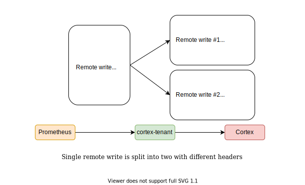

# cortex-tenant

[](https://goreportcard.com/report/github.com/blind-oracle/cortex-tenant)
[](https://coveralls.io/github/blind-oracle/cortex-tenant?branch=main)
[](https://www.travis-ci.com/blind-oracle/cortex-tenant)

Prometheus remote write proxy which marks timeseries with a Cortex tenant ID based on labels.

## Architecture



## Overview

Cortex tenants (separate namespaces where metrics are stored to and queried from) are identified by `X-Scope-OrgID` HTTP header on both writes and queries.

Problem is that Prometheus can't be configured to send this header. And even if it was possible to set it in the remote write configuration - it would be the same for all jobs. This makes it impossible to use a single Prometheus (or an HA pair) to write to multiple tenants.

This proxy solves the problem using the following logic:

- Receive Prometheus remote write
- Search each timeseries for a specific label name and extract a tenant ID from its value.
  If the label wasn't not found then it can fall back to a configurable default ID.
  If none is configured then the write request will be rejected.
- Optionally removes this label from the timeseries
- Groups timeseries by tenant
- Issues a number of parallel per-tenant HTTP requests to Cortex with the relevant tenant HTTP header (`X-Scope-OrgID` by default)

## Usage

- Get `rpm` or `deb` for amd64 from the Releases page. For building see below.

### HTTP Endpoints

- GET `/alive` returns 200 by default and 503 if the service is shutting down (if `timeout_shutdown` setting is > 0)
- POST `/push` receives metrics from Prometheus - configure remote write to send here

### Configuration

Application expects the config file at `/etc/cortex-tenant.yml` by default.

```yaml
# Where to listen for incoming write requests from Prometheus
listen: 0.0.0.0:8080
# Profiling API, remove to disable
listen_pprof: 0.0.0.0:7008
# Where to send the modified requests (Cortex)
target: http://127.0.0.1:9091/receive
# Log level
log_level: warn
# HTTP request timeout
timeout: 10s
# Timeout to wait on shutdown to allow load balancers detect that we're going away.
# During this period after the shutdown command the /alive endpoint will reply with HTTP 503.
# Set to 0s to disable.
timeout_shutdown: 10s

tenant:
  # Which label to look for the tenant information
  label: tenant
  # Whether to remove the tenant label from the request
  label_remove: true
  # To which header to add the tenant ID
  header: X-Scope-OrgID
  # Which tenant ID to use if the label is missing in any of the timeseries
  # If this is not set or empty then the write request with missing tenant label
  # will be rejected with HTTP code 400
  default: foobar
  # Enable if you want all metrics from Prometheus to be accepted with a 200 
  # Regardless of the response from Cortex. This can lose metrics if Cortex is 
  # throwing rejections.
  accept_all: false
```

### Prometheus configuration example

```yaml
remote_write:
  - name: cortex_tenant
    url: http://127.0.0.1:8080/push

scrape_configs:
  - job_name: job1
    scrape_interval: 60s
    static_configs:
      - targets:
          - target1:9090
        labels:
          tenant: foobar

  - job_name: job2
    scrape_interval: 60s
    static_configs:
      - targets:
          - target2:9090
        labels:
          tenant: deadbeef
```

This would result in `job1` metrics ending up in the `foobar` tenant in cortex and `job2` in `deadbeef`.

## Building

`make build` should create you an _amd64_ binary.

If you want `deb` or `rpm` packages then install [FPM](https://fpm.readthedocs.io) and then run `make rpm` or `make deb` to create the packages.

## Containerization

To use the current container you need to overwrite the default configuration file. The Docker file uses a environment called `CONFIG_PATH` with the following value: `ENV CONFIG_FILE cortex-tenant.yml`. 
This file get written to the workdir `/data`.

You can overwrite the default config by starting the container with 
```bash
docker container run \
-v <CONFIG_LOCATION>:/data/cortex-tenant.yml \
vincentfree/cortex-tenant:1.3.3
```

you canalsowrite it to your prefered location and update the environment variable like this
```bash
docker container run \
-e CONFIG_PATH=/data/config.yml \
-v <CONFIG_LOCATION>:/data/config.yml \
vincentfree/cortex-tenant:1.3.3
```
