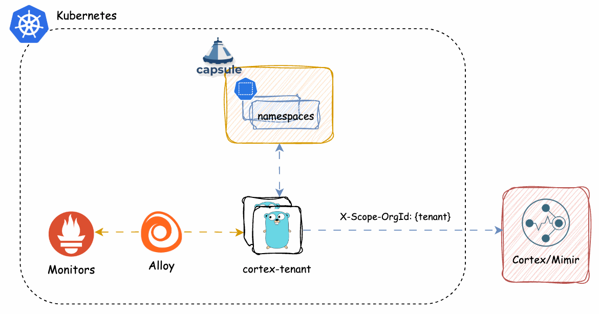

[!IMPORTANT]
This project is a permanent hard-fork of the origin project.

# Capsule ❤️ Cortex

Prometheus remote write proxy which marks timeseries with a Cortex/Mimir tenant ID based on labels.

## Overview

Cortex/Mimir tenants (separate namespaces where metrics are stored to and queried from) are identified by `X-Scope-OrgID` HTTP header on both writes and queries.

This software solves the problem using the following logic:

- Receive Prometheus remote write
- Search each timeseries for a specific label name and extract a tenant ID from its value.
  If the label wasn't found then it can fall back to a configurable default ID.
  If none is configured then the write request will be rejected with HTTP code 400
- Optionally removes this label from the timeseries
- Groups timeseries by tenant
- Issues a number of parallel per-tenant HTTP requests to Cortex/Mimir with the relevant tenant HTTP header (`X-Scope-OrgID` by default)

## Documentation

See the [Documentation](docs/README.md) for more information on how to use this addon.

## Support

This addon is developed by the community. For enterprise support (production ready setup,tailor-made features) reach out to [Capsule Supporters](https://projectcapsule.dev/support/)
